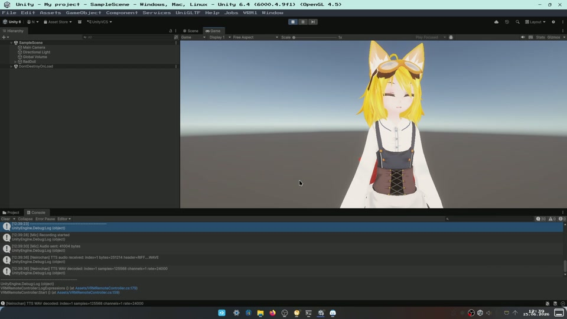
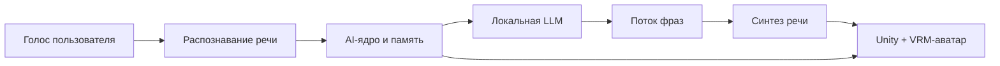
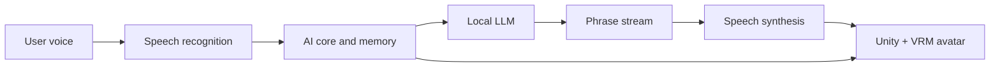

# Neirochan

### A local AI character that listens, thinks, remembers, speaks, and reacts.

[Русский](#русский) · [English](#english) · [Watch the demo](media/neirochan-demo.mp4)

  <strong>Click the image to watch the full video demonstration.</strong>

---

## Русский

### Не просто ещё один чат с нейросетью

Я долгое время разрабатывал Neirochan как эксперимент над тем, каким может быть локальный AI-персонаж. Мне хотелось уйти от привычного окна с сообщениями и собрать систему, с которой можно разговаривать голосом, видеть её реакцию и ощущать живое присутствие на экране.

В демонстрации показан настоящий рабочий цикл без заранее записанных ответов:

1. Я говорю в микрофон через Unity.
2. Речь локально распознаётся и превращается в текст.
3. AI формирует ответ с учётом контекста разговора.
4. Первые готовые фразы сразу отправляются в синтез речи.
5. Unity получает аудио и эмоциональные события.
6. VRM-персонаж отвечает голосом, двигает ртом и меняет выражение лица.

> Терминал в видео оставлен намеренно: в нём видно запуск компонентов и прохождение каждого запроса через реальный пайплайн.

### Что уже умеет Neirochan

- вести естественный голосовой диалог;
- запускать локальную языковую модель;
- распознавать речь локально;
- начинать озвучку до завершения полного ответа;
- сохранять контекст и важные детали между разговорами;
- автоматически выбирать эмоцию для ответа;
- синхронизировать речь, мимику, моргание и движения VRM-аватара;
- подключать зрение, поиск и ограниченное взаимодействие с компьютером.

### Почему потоковая озвучка важна

Если сначала дождаться полного ответа модели, затем полностью синтезировать голос и только потом начать воспроизведение, персонаж надолго замолкает. В Neirochan ответ разбивается на законченные фразы: пока модель продолжает думать над следующей частью, первая уже озвучивается и воспроизводится в Unity.

Это делает разговор заметно живее и ближе к обычному человеческому диалогу.

### Как всё связано

### Технологии

`Python` · `FastAPI` · `WebSocket` · `llama.cpp` · `Whisper` · `Unity` · `C#` · `UniVRM`

Neirochan продолжает развиваться. Публичный репозиторий содержит демонстрацию и описание проекта; исходный код, модели, конфигурация и данные памяти не публикуются.

---

## English

### More than another AI chat window

I have been building Neirochan for a long time as an experiment in creating a local AI character. I wanted to move beyond a regular message interface and build a system you can speak with, watch react, and experience as a presence on the screen.

The video shows a real end-to-end conversation without prerecorded responses:

1. I speak through the Unity client.
2. Speech is transcribed locally.
3. The AI generates a response using the conversation context.
4. Completed phrases are immediately sent to speech synthesis.
5. Unity receives audio and emotion events.
6. The VRM character speaks, lip-syncs, and changes its expression.

> The terminal is intentionally visible in the video so the startup sequence and live request pipeline can be seen working.

### What Neirochan Can Do

- hold natural voice conversations;
- run a language model locally;
- transcribe speech locally;
- begin speaking before the full answer is complete;
- retain context and useful details between conversations;
- automatically choose an emotion for each response;
- synchronize speech, facial expressions, blinking, and VRM avatar motion;
- connect vision, web search, and restricted computer interaction tools.

### Why Streaming Speech Matters

Waiting for the complete model response and full voice synthesis creates an awkward silence. Neirochan splits responses into complete phrases. While the model is still generating the next part, the first phrase is already being synthesized and played in Unity.

The result feels significantly closer to a natural conversation.

### How It Fits Together

### Technologies

`Python` · `FastAPI` · `WebSocket` · `llama.cpp` · `Whisper` · `Unity` · `C#` · `UniVRM`

Neirochan is still evolving. This public repository contains the demonstration and project overview; source code, model files, configuration, and memory data are not published.

